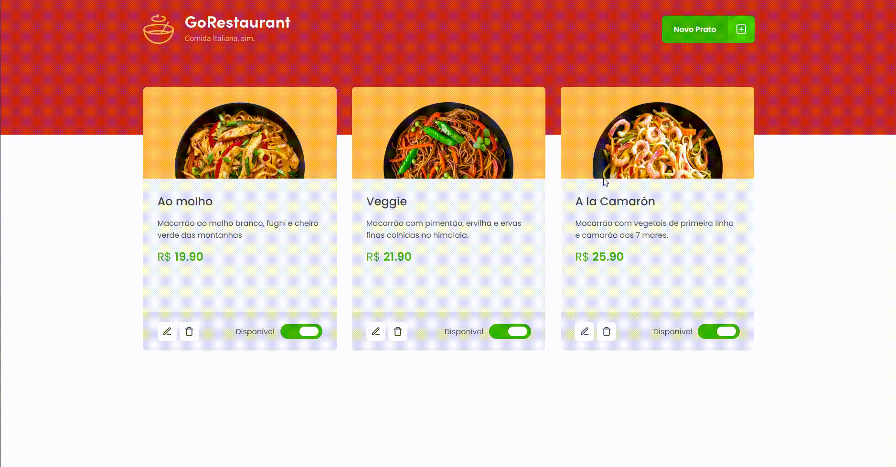

<p align="center">
  <a href="#-tecnologias">Tecnologias</a>&nbsp;&nbsp;&nbsp;|&nbsp;&nbsp;&nbsp;
  <a href="#-preview">Preview</a>&nbsp;&nbsp;&nbsp;|&nbsp;&nbsp;&nbsp;
  <a href="#-getting-started">Getting started</a>&nbsp;&nbsp;&nbsp;|&nbsp;&nbsp;&nbsp;
  <a href="#-projeto">Projeto</a>&nbsp;&nbsp;&nbsp;|&nbsp;&nbsp;&nbsp;
  <a href="#-template">Template</a>
</p>

## 🧪 Tecnologias

Este projeto utiliza as seguintes tecnologias:

- [React](https://reactjs.org)
- [TypeScript](https://www.typescriptlang.org/)
- [Styled Components](https://styled-components.com/)

## 🔥 Preview

\*
<br>

<p align="center">
  <a href="https://gorestaurant-vf.netlify.app/" target="_blank">
    
  </a>
</p>

\*Pode ser que demore um pouco para carregar as informações. Portanto, aguarde um pouco e se persistir tente carregar novamente a página.

## 🚀 Getting started

Clone o projeto e acesse a pasta

```bash
$ git clone https://github.com/Vitor-Franco/02-02-refactoring-classes-typescript.git && cd 02-02-refactoring-classes-typescript
```

Siga o passo-passo abaixo.

```bash
# Instale as dependências
$ yarn

# Rode a fake API
$ yarn server

# Start o projeto
$ yarn start
```

## 📝 Projeto

#### Desafio Complementar da trilha de ReactJS.

Antigamente era muito comum o uso de **class components** no React. 
Portanto, neste desafio precisamos entender como funciona os **class components** presentes no template e passá-los para **functional components**, mantendo o mesmo funcionamento da aplicação. 
Além de passar toda aplicação de **Javascript** para **Typescript**, assim fazendo a **tipagem** de todos os dados.

Projeto desenvolvido durante Bootcamp Ignite da [@Rocketseat](https://github.com/Rocketseat).

## 🖥 Template

Você pode acessar o template do desafio em:

- [Template Challenge](https://github.com/rocketseat-education/ignite-template-reactjs-refactoring-classes-ts/)

---

<p align="center">Made with 💜 by Vitor Franco</p>
